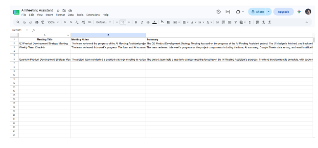
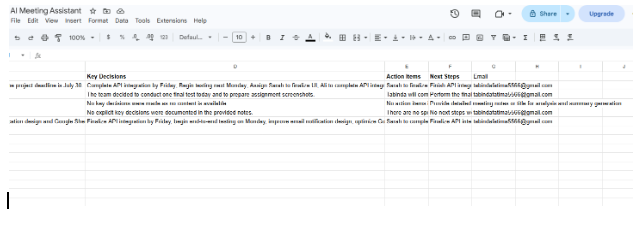
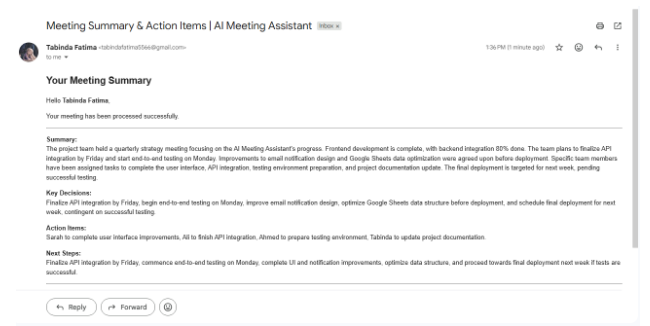

# AI Meeting Assistant

An AI-powered meeting documentation workflow built with **n8n** and **OpenAI**. It converts raw meeting notes into a structured meeting summary, key decisions, action items, and next steps.

The generated information is automatically stored in Google Sheets and delivered to the user through a personalized Gmail message.

---

## Problem It Solves

Meeting notes often contain important discussions, decisions, responsibilities, and follow-up tasks. Organizing this information manually can be repetitive and time-consuming.

AI Meeting Assistant automates the entire meeting documentation process.

Users only need to provide:

- Meeting title
- Meeting notes
- Name
- Email address

The workflow then analyzes the notes, generates structured meeting documentation, stores the information in Google Sheets, and sends the final summary through email.

---

## Features

- Form-based meeting detail submission
- AI-powered meeting note analysis
- Professional meeting summary generation
- Automatic identification of key decisions
- Action item extraction
- Next-step recommendations
- Structured AI output
- Automatic Google Sheets storage
- Personalized Gmail delivery
- End-to-end n8n automation

---

## Workflow Architecture

### 1. Form Trigger

The workflow starts when a user submits the meeting form.

The form collects:

- Meeting Title
- Meeting Notes
- Name
- Email Address

### 2. AI Agent

The AI Agent analyzes the submitted meeting notes and generates:

- Meeting Summary
- Key Decisions
- Action Items
- Next Steps

### 3. OpenAI Chat Model

The workflow uses **OpenAI GPT-4.1 Mini** to understand the meeting notes and create professional meeting documentation.

### 4. Structured Output Parser

The Structured Output Parser converts the AI response into organized fields:

- `summary`
- `key_decisions`
- `action_items`
- `next_steps`

This ensures that the data can be used reliably by the next workflow nodes.

### 5. Google Sheets

The processed meeting information is automatically stored in Google Sheets.

The sheet includes:

- Meeting Title
- Meeting Notes
- Email
- Summary
- Key Decisions
- Action Items
- Next Steps

### 6. Gmail

After the meeting information is stored, Gmail sends a personalized email to the user.

The email contains:

- Meeting Summary
- Key Decisions
- Action Items
- Next Steps

---

## Workflow Process

```text
Meeting Form
     ↓
AI Agent
     ↓
OpenAI Chat Model
     ↓
Structured Output Parser
     ↓
Google Sheets
     ↓
Gmail
```

---

## Tech Stack

- n8n
- OpenAI GPT-4.1 Mini
- AI Agent
- Structured Output Parser
- Google Sheets
- Gmail
- n8n Form Trigger

---

## Screenshots

### n8n Workflow

The complete n8n workflow connecting the form, AI Agent, OpenAI model, Structured Output Parser, Google Sheets, and Gmail.

![n8n Workflow][(workflow_.png)](https://github.com/Tabinda-Fatima/AI-Meeting-Assistant/blob/main/workflow..png)

---

### Google Sheets Meeting Data

The first section of the generated Google Sheet showing the meeting title, meeting notes, and AI-generated summary.



---

### Google Sheets Structured Output

The additional Google Sheets columns containing key decisions, action items, next steps, and email information.



---

### Personalized Email Output

The personalized email sent to the user with the meeting summary, key decisions, action items, and next steps.



---

## How It Works

1. The user opens the n8n meeting form.
2. The user enters the meeting title, notes, name, and email address.
3. The AI Agent analyzes the submitted meeting notes.
4. OpenAI generates a professional meeting summary.
5. The Structured Output Parser separates the response into organized fields.
6. Google Sheets stores the complete meeting information.
7. Gmail sends the processed meeting summary to the user.

---

## Setup Instructions

### 1. Import the Workflow

Import the workflow JSON file into your n8n instance.

### 2. Configure OpenAI

Add your OpenAI API credentials to the OpenAI Chat Model node.

### 3. Configure Google Sheets

Connect your Google Sheets account and select the required spreadsheet.

The spreadsheet should contain the following columns:

```text
Meeting Title
Meeting Notes
Email
Summary
Key Decisions
Action Items
Next Steps
```

### 4. Configure Gmail

Connect your Gmail account to the Gmail node.

### 5. Activate the Workflow

Activate the workflow and open the n8n form URL.

### 6. Submit Meeting Details

Enter the meeting information and submit the form.

The workflow will automatically:

- Analyze the meeting notes
- Generate structured results
- Save the data in Google Sheets
- Send the summary through Gmail

---

## Repository Files

```text
AI-Meeting-Assistant/
│
├── README.md
├── ai-meeting-assistant-workflow.json
├── workflow_.png
├── google-sheet.png
├── google-sheet1.png
└── email-output.png
```

---

## Security Note

Credentials and API keys are not included in this repository.

Users must configure their own:

- OpenAI credentials
- Google Sheets credentials
- Gmail credentials

---

## Use Cases

This workflow can be used for:

- Team meetings
- Project planning meetings
- Client meetings
- Weekly progress meetings
- Strategy meetings
- Remote team discussions
- Internal business meetings

---

## Author

**Tabinda Fatima**

AI Automation & Workflow Developer
